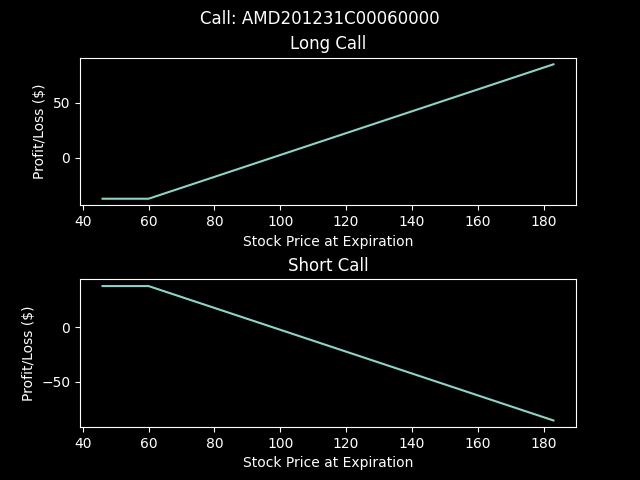

# Vops
This python project uses data from yahoo finance to graph option profit-loss diagrams.

Note: any examples used here are outdated because the option contracts have expired.

## Installing
Installing with pip:
```bash
pip install vops
```

## Usage
Simple program graphing a long call option:
```python
from vops import scraping
from vops import graphing

contractName = 'AMD201218C00040000'
optionObj = scraping.scrapeCallOptions('AMD')

graphing.graphLongCall(optionObj, contractName)
```
Graphing both short and long positions on a call option:
```python
optionObj = scraping.scrapeCallOptions('TSLA')

graphing.graphCalls(optionObj, 'TSLA201224C00020000')
```

Exporting graphs to a png:
```python
graphing.graphCalls(optionObj, 'TSLA201224C00020000', export = True)
```

Output:


